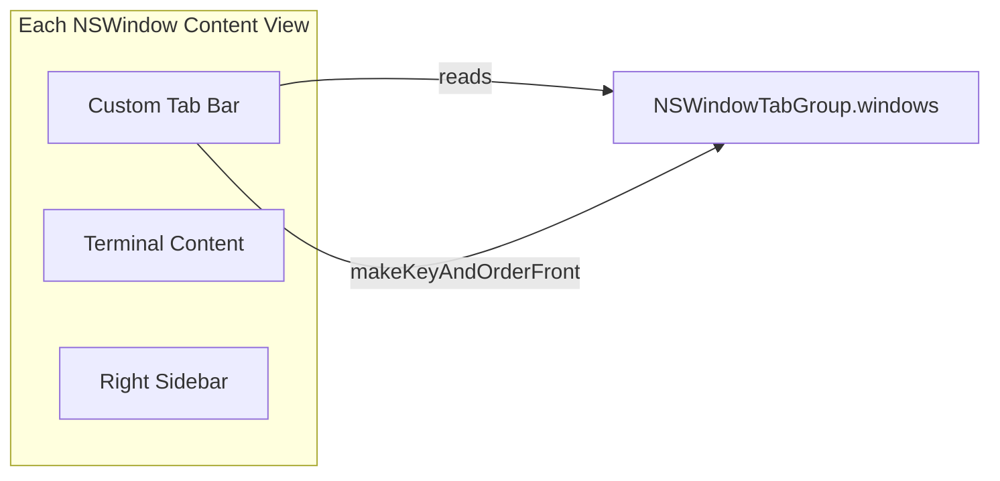

<!-- 94d22df5-8434-4878-81ff-f15678d7729d -->
---
todos:
  - id: "config-overlay"
    content: "Add GingerTTYConfig singleton: parse macos-tab-bar from config file, filter diagnostic from Ghostty.Config.errors"
    status: pending
  - id: "hide-native-bar"
    content: "Hide native tab bar in TerminalWindow when custom mode active; KVO re-hide on tab additions; nib override in TerminalController"
    status: pending
  - id: "tab-group-observation"
    content: "Add tabGroupVersion counter and gingerTTYTabGroupDidChange notification to TerminalController"
    status: pending
  - id: "tab-bar-views"
    content: "Build VerticalTabBar and HorizontalTabBar SwiftUI views with shared TabGroupDataSource"
    status: pending
  - id: "layout-integration"
    content: "Wire custom tab bars into TerminalWindowView layout based on config mode"
    status: pending
  - id: "pr-reviews-button"
    content: "Add PR Reviews button to RightSidebarRail and RightSidebarInspector"
    status: pending
  - id: "tests"
    content: "Add unit tests for config parsing, diagnostic filtering, and tab group data source"
    status: pending
isProject: false
---
# Custom macOS Tab Bar (Vertical Default)

## Architecture

Keep native `NSWindowTabGroup` as the tab data model. Each tab remains a separate `NSWindow` managed by AppKit. The custom tab bar is a SwiftUI sidebar/header rendered in every window's `TerminalWindowView`, reading its data from `window.tabGroup?.windows`. Tab switching calls `makeKeyAndOrderFront` on the target window -- same mechanism as `onGotoTab` already uses.



No changes to: tab creation, close, move, goto, undo/redo, window restoration, or AppleScript.

## 1. GingerTTY Config Overlay

**New file: `macos/Sources/Helpers/GingerTTYConfig.swift`**

- Enum `GingerTTYTabBarMode { case vertical, horizontal, native }`
- Parse `macos-tab-bar` from `~/.config/ghostty/config` (and `config-file` includes), defaulting to `vertical`
- Reads the same config file Ghostty reads (respects `GHOSTTY_CONFIG_PATH` env var)
- Simple line-by-line key=value parser; only extracts keys prefixed `gingertty-` or specifically `macos-tab-bar`
- Singleton `GingerTTYConfig.shared` loaded once at app startup
- Expose `tabBarMode: GingerTTYTabBarMode`

**Modified: `macos/Sources/Ghostty/Ghostty.Config.swift`**

- Filter `macos-tab-bar` from the `errors` array so users don't see an "unknown key" diagnostic window

## 2. Hide Native Tab Bar

**Modified: `macos/Sources/Features/Terminal/Window Styles/TerminalWindow.swift`**

- In `awakeFromNib()`, after the existing `tabbingMode` setup, if `GingerTTYConfig.shared.tabBarMode != .native`, post a delayed `toggleTabBar(nil)` call to hide the native tab bar when it becomes visible (2+ tabs)
- Add KVO on `tabGroup?.isTabBarVisible` (same pattern as `TransparentTitlebarTerminalWindow` already uses) to re-hide whenever macOS re-shows the native bar after tab additions

**Modified: `macos/Sources/Features/Terminal/TerminalController.swift`**

- In `windowNibName`: when `tabBarMode != .native` and `macosTitlebarStyle == "tabs"`, return the `"Terminal"` nib instead of the tabs nib, since our custom bar replaces it

## 3. Tab Group Observation

**Modified: `macos/Sources/Features/Terminal/TerminalController.swift`**

- Add `@Published var tabGroupVersion: UInt = 0` -- a counter bumped whenever the tab group changes
- Bump it in: `relabelTabs()` (already called on becomeKey, close, move, new tab, frame changes), and in `windowWillClose`
- Post a `Notification.Name.gingerTTYTabGroupDidChange` notification in the same places for cross-window visibility

## 4. Custom Tab Bar Views

**New file: `macos/Sources/Features/Terminal/TerminalCustomTabBar.swift`**

### VerticalTabBar
- Left sidebar, ~200px wide, background `.windowBackgroundColor`
- Reads tab data: `controller.window?.tabGroup?.windows.compactMap { $0.windowController as? TerminalController }`
- Refreshes via `.onReceive` on `NSWindow.didBecomeKeyNotification`, `NSWindow.willCloseNotification`, and `.gingerTTYTabGroupDidChange`
- Each tab row shows:
  - Color indicator dot (from `TerminalWindow.tabColor`)
  - Window title (from `window.title`)
  - Close button on hover
  - Selected state highlight when `controller === self`
- Tab click: `tabController.window?.makeKeyAndOrderFront(nil)`
- Tab close: `tabController.closeTab(nil)`
- Bottom pinned buttons:
  - "New Tab" -- calls `controller.newTab(nil)`
  - "New Worktree" -- calls `controller.presentWorktreeSheet()`

### HorizontalTabBar
- Top bar below titlebar, same data source as vertical
- Tab items in a horizontal scroll, truncated titles
- Trailing action group: "New Tab" and "New Worktree"

Both views share a common `TabGroupDataSource` helper that encapsulates the refresh logic and data extraction.

## 5. Layout Integration

**Modified: `macos/Sources/Features/Terminal/TerminalSidebarView.swift`** (`TerminalWindowView`)

Current layout:

```
HStack {
    terminalContent
    rightSidebar
}
```

New layout:

```
HStack/VStack {
    if tabBarMode == .vertical {
        VerticalTabBar(controller:)
        Divider()
    }
    VStack {
        if tabBarMode == .horizontal {
            HorizontalTabBar(controller:)
            Divider()
        }
        HStack {
            terminalContent
            rightSidebar
        }
    }
}
```

The mode is read from `GingerTTYConfig.shared.tabBarMode`. When `.native`, no custom bar is shown -- current behavior.

## 6. PR Reviews Button

**Modified: `macos/Sources/Features/Terminal/TerminalSidebarView.swift`** (`RightSidebarRail` and `RightSidebarInspector`)

- `RightSidebarRail`: add a "PR Reviews" button (SF Symbol `text.bubble`) at the bottom of the rail, below a `Spacer()`, calling `controller.presentPRReviewSheet()`
- `RightSidebarInspector`: add the same button at the bottom of the expanded sidebar

## Files Changed Summary

- **New**: `macos/Sources/Helpers/GingerTTYConfig.swift` -- config overlay
- **New**: `macos/Sources/Features/Terminal/TerminalCustomTabBar.swift` -- vertical + horizontal tab bar views
- **Modified**: `macos/Sources/Ghostty/Ghostty.Config.swift` -- filter `macos-tab-bar` from diagnostics
- **Modified**: `macos/Sources/Features/Terminal/Window Styles/TerminalWindow.swift` -- hide native tab bar
- **Modified**: `macos/Sources/Features/Terminal/TerminalController.swift` -- tab group versioning, nib override
- **Modified**: `macos/Sources/Features/Terminal/TerminalSidebarView.swift` -- layout integration + PR Reviews button

## Tests

**Modified: `macos/Tests/`**

- `testGingerTTYConfigParsesVertical` -- explicit `macos-tab-bar = vertical`
- `testGingerTTYConfigParsesHorizontal` -- explicit `macos-tab-bar = horizontal`
- `testGingerTTYConfigDefaultsToVertical` -- absent key defaults to vertical
- `testGingerTTYConfigFiltersUnknownKeyDiagnostic` -- `macos-tab-bar` not in error list
- `testTabGroupDataSourceReturnsControllers` -- data source extracts controllers from tab group

## Open Questions

None -- this approach requires no Ghostty core changes and preserves all existing tab behavior.
