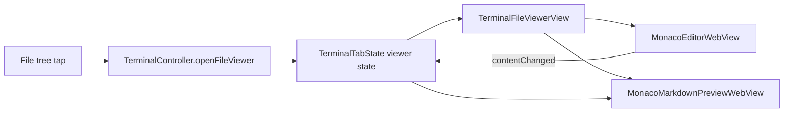

<!-- e969b454-491f-4e10-b83a-082ce2b38556 -->
---
todos:
  - id: "split-viewer-layout"
    content: "Branch the file viewer into markdown split mode for `.md` files while keeping non-markdown behavior unchanged."
    status: pending
  - id: "monaco-markdown-preview"
    content: "Implement a Monaco-based markdown preview pane using the upstream renderMarkdown/colorize approach and app theme colors."
    status: pending
  - id: "live-sync-preview"
    content: "Wire editor draft updates and theme changes into the preview with debounce and no regressions to save/find flows."
    status: pending
  - id: "tests-and-validation"
    content: "Add markdown viewer tests and validate with the macOS xcodebuild test command plus manual markdown-file checks."
    status: pending
isProject: false
---
# Markdown Preview In File Viewer

## Current Hook Points

```1341:1344:macos/Sources/Features/Terminal/TerminalSidebarView.swift
FileTreeFileRow(node: child, depth: depth, isHighlighted: isHighlighted)
    .contentShape(Rectangle())
    .onTapGesture {
        controller.openFileViewer(relativePath: child.relativePath)
    }
```

```1639:1652:macos/Sources/Features/Terminal/TerminalDiffView.swift
} else if let content = tab.viewerFileContent,
          let path = tab.viewerFilePath {
    MonacoEditorWebView(
        filePath: path,
        content: content,
        theme: codeTheme,
        editorModel: editorModel,
        onContentChanged: { content in
            controller.updateViewerDraftContent(content)
        },
        onSaveRequested: { content in
            controller.saveViewerFile(contentOverride: content)
        }
    )
}
```

## Proposed Flow



## Implementation

- Keep Monaco editable on the left for all files.
- For `*.md` files only, show a right-side preview pane next to the editor instead of replacing the editor.
- Render the preview with Monaco's markdown renderer per issue `microsoft/monaco-editor#892`, using Monaco's code-block colorization so fenced code stays highlighted and theme-aware.
- Drive preview refreshes from the existing draft-content updates, with a small debounce so typing stays responsive.
- Preserve current save, revert, and find behavior; non-markdown files stay on the current single-pane Monaco path.

## Files To Change

- `macos/Sources/Features/Terminal/TerminalDiffView.swift`
  - Branch `TerminalFileViewerView` into two layouts: the current single-pane editor for non-markdown files, and a split editor/preview layout for `.md` files.
  - Reuse the existing `ResizableDivider` pattern so the markdown preview is a native side-by-side pane instead of a fixed-width preview.
  - Keep the header actions (`Save`, `Revert`, close, `Cmd+F`, `Cmd+S`) unchanged.

- `macos/Sources/Features/Terminal/TerminalMonacoEditorView.swift`
  - Keep `MonacoEditorWebView` as the editable editor.
  - Add a Monaco-backed markdown preview wrapper/helper that loads the bundled Monaco assets and renders markdown to HTML using the approach from the upstream issue: Monaco markdown rendering plus `monaco.editor.colorize()` for fenced code blocks.
  - Apply `TerminalCodeTheme` colors to the preview container so it matches the existing editor and responds to light/dark changes.
  - Update the preview when `content` or theme changes, without altering the existing editor message bridge.

- `macos/Tests/Terminal/TerminalFileViewerMarkdownTests.swift`
  - Add focused tests for markdown preview eligibility and split-layout helper behavior so the `.md` branch stays easy to reason about.

- `macos/Tests/Terminal/TerminalTabStateTests.swift`
  - Extend existing file-viewer tests to confirm markdown files still use the same dirty/save/revert lifecycle as other file types.

## Tests

- `markdownPreviewIsEnabledForMdFiles`
  - Verifies a `.md` path opts into the split editor/preview path.

- `markdownPreviewIsDisabledForNonMdFiles`
  - Verifies non-markdown files keep the existing single-editor path.

- `markdownDraftEditsStillMarkViewerDirty`
  - Verifies markdown edits still set `isViewerDirty`, `canSaveViewerFile`, and `canRevertViewerFile`.

- `markdownSavePromotesDraftToOriginal`
  - Verifies saving a markdown draft still updates `viewerOriginalContent` and clears dirty state.

## Validation

- Run:
  - `env -i HOME="$HOME" PATH="/usr/bin:/bin:/usr/sbin:/sbin" xcodebuild -project macos/Ghostty.xcodeproj -scheme Ghostty -configuration Debug SYMROOT=macos/build -skip-testing GhosttyUITests test`
- Manually verify:
  - opening `README.md` from the file tree shows editor + preview
  - typing updates the preview live
  - `Cmd+F`, `Cmd+S`, `Save`, and `Revert` still operate on the editor
  - opening a non-`.md` file still shows the current Monaco-only viewer
